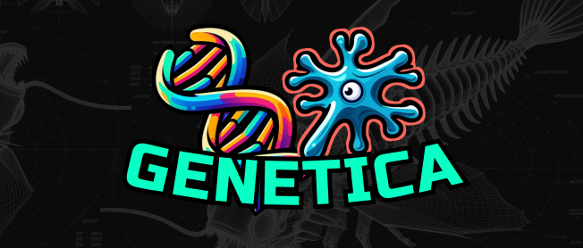

Based on an earlier project I made using Uava called [Hyperlife](https://github.com/seanjhardy/HyperLife)

# PROJECT GENETICA
A GPU-accelerated genetic algorithm using CUDA.

Genetica combines a 2D physics environment, with multicellular creature morphology and advanced modular neuroevolution to simulate evolution
